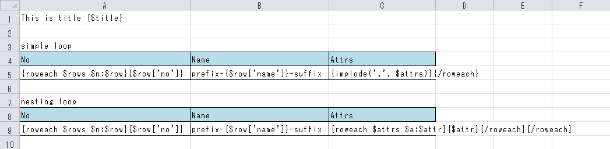
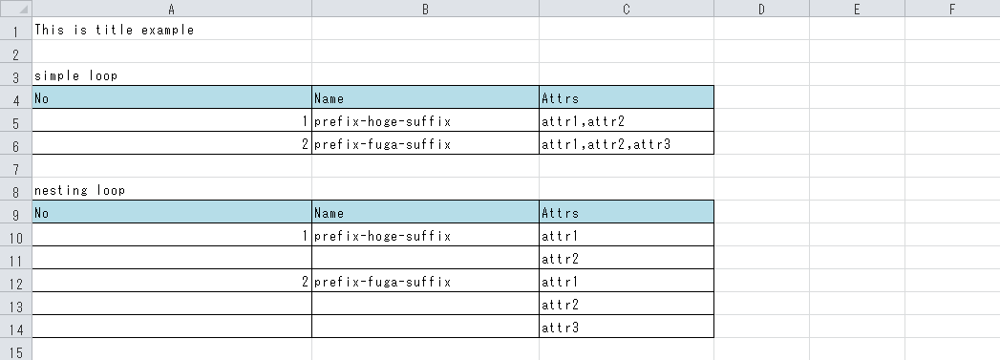

PHPExcelTemplate
====

## Description

PHPSpreadsheet にシート内埋め込みコードを可能にしたライブラリです。

- roweach/coleach による行列操作
- rowshift/colshift による行列シフト
- eval による php ライクな埋め込みタグ

## Install

```json
{
    "require": {
        "ryunosuke/php-excelate": "dev-master"
    }
}
```

## Demo

```php
php /path/to/excelate/demo/run.php
```



```php
$renderer = new Renderer();

// ブック全体をレンダリング（拡張子に応じて reader/writer が決まり、一時ファイルに書き出される）
$renderer->renderBook(__DIR__ . '/template.xlsx', [
    0       => [ // 基本はシート番号
        'title' => 'example',
        'rows'  => [
            ['no' => 1, 'name' => 'hoge', 'attrs' => ['attr1', 'attr2']],
            ['no' => 2, 'name' => 'fuga', 'attrs' => ['attr1', 'attr2', 'attr3']],
        ],
    ],
    'sheet' => [], // シート名でもよい
    ''      => [], // 空文字はアクティブシートを意味する
]);

// あるいはシートを個別にレンダリング
$book = IOFactory::load(__DIR__ . '/template.xlsx');
$renderer->renderSheet($book->getSheet(0), [
    'title' => 'example',
    'rows'  => [
        ['no' => 1, 'name' => 'hoge', 'attrs' => ['attr1', 'attr2']],
        ['no' => 2, 'name' => 'fuga', 'attrs' => ['attr1', 'attr2', 'attr3']],
    ],
]);
IOFactory::createWriter($book, 'Xlsx')->save(__DIR__ . '/template-out.xlsx');
```



## Usage

基本的に demo をベースに説明します。

### タグ

使用できる構文は下記です。

| 構文             | 説明 |
| :--              | :--  |
| {template}       | テンプレート範囲を表すタグです。閉じタグはありません |
| {row}            | 配列を行として埋め込みます。閉じタグはありません |
| {col}            | 配列を列として埋め込みます。閉じタグはありません |
| {rowcol}         | 配列の配列を行列として埋め込みます。閉じタグはありません |
| {rowif}          | 行レベルif文です。 `{/rowif}` で閉じます |
| {colif}          | 列レベルif文です。 `{/colif}` で閉じます |
| {if}             | 強制行レベルif文です。 `{/if}` で閉じます |
| {roweach}        | 行を増やすためのループタグです。 `{/roweach}` で閉じます |
| {coleach}        | 列を増やすためのループタグです。 `{/coleach}` で閉じます |
| {rowshift}       | 行をシフトするためのループタグです。 `{/rowshift}` で閉じます |
| {colshift}       | 列をシフトするためのループタグです。 `{/colshift}` で閉じます |
| {ldelim}         | `{` 文字を表すタグです |
| {rdelim}         | `}` 文字を表すタグです |

#### template

A1セルのみに記述が許可されます。
このタグを書くとレンダリング範囲を明示的に指定することが出来ます。
例えば `{template A1:C12}` と記述すると `A1:C12` 外は一切レンダリングされません。

書かなくても動きますが、その場合のデフォルト範囲は「データのある範囲」です。場合によっては明示的に指定したほうが高速に動作します。

なお、レンダリング範囲は素のテンプレートの状態の範囲です。レンダリングによって行・列が増加した場合は適宜拡張されます。
（「何行増えるか？」は意識しなくてよいということです）。

#### row

配列を行として直接埋め込みます。
普通に使うには呼び出し側 php で配列の値を整形しておく必要がありますが、その分高速に動作します。
`{row $array => "{$k}:{$v}"}` というフォーマット構文もありますが、このタグを使う場合は高速化が狙いなのでほぼ出番はありません。

- `{row $array}` $array が A, B, C なら3列に A B C を展開します
- `{row $array => "{$k}:{$v}"}` $k, $v を通して展開します（他にも $first, $last, $index が使えます）

#### col

row の列バージョンです。

配列を列として（縦方向に）展開します。

#### rowcol

配列の配列を直接埋め込みます。
一切の埋め込み構文は使えず、呼び出し側 php で配列の値を整形しておく必要がありますが、その分高速に動作します。
典型的にはデータベースからフェッチしたようなレコード配列をダイレクトに埋め込む用途です。

- `{rowcol $records:true}` キー配列を最初に追加します
- `{rowcol $records:false}` キー配列を埋め込みません

#### rowif

`{rowif $condition}` ～ `{/rowif}` とすることで、 $condition の真偽でレンダリングをスキップできます。
$condition は変数も使えますが、 php の式も使えます。
つまり `{rowif $flag1 && !$flag2}` のような論理演算や `{rowif strpos($name, 'hoge') === false}` のような式が使えます。

$condition が真の場合は単純にifタグがなかったかのように振る舞います。
偽の場合はタグブロックを吹き飛ばして存在をなかったことにします。
偽のとき rowif, /rowif の位置によって下記のように挙動が変わります。

- 左右がテンプレート範囲にピッタリ収まっているとき
  - 行自体が吹き飛びます。エクセルで言うとセルを選択して削除を選んだ後のメニューの「行全体」に当たります
- 左右がテンプレート範囲にピッタリ収まっていないとき
  - ブロックがアンシフトされます。エクセルで言うとセルを選択して削除を選んだ後のメニューの「上方向にシフト」に当たります

基本的にはピッタリ収めて使います。
シフトは列がズレるため、使い勝手が悪い（というか実質使い物にならない）ためです。

`{if}` を使うと「強制的にピッタリ収めた{rowif}」として扱われます。
これは `{roweach $items}{if $flag}...{/if}{/roweach}` というよくありそうな構文を許容するためです。

ただし、将来的には「col/row のコンテキストを見て自動で判断される」という実装にする予定です。
（`{coleach $items}{if $flag}...{/if}{/coleach}` の中の if は colif と判断される）。
つまりいつかは「{if}は常に row モード」という前提が崩れるので注意してください。
が、まぁ普通に使う分には気にしなくてよいです。端的に言えば「ループに囲まれていない素の {if} は使うな」ということです。

#### colif

rowif の列バージョンです。使い方はすべて同じですが、「ピッタリ」の定義は左右ではなく上下です。

基本的にはピッタリ収めず使います。
列追加は全行に及ぶため、使い勝手が悪い（というか実質使い物にならない）ためです。

そもそも col で if したい状況があまり想像できないため、単に rowif の対として実装されています。

#### roweach

要素分ループして `/roweach` までのセル範囲をコピーしてレンダリングします。

いくつか構文があって

- `{roweach $Values}` $Values をループします。その際の要素を参照する方法は後述します
- `{roweach $Values $Value}` $Values をループします。 $Value に要素値がアサインされます
- `{roweach $Values $Key:$Value}` $Values をループします。 $Key にキーが、 $Value に要素値がアサインされます

上記の通り、ループ変数だけの指定が可能です。この場合、 キーは $k, 値は $v とみなしてアサインされます。
ループごとに入れ子になるわけではないので、ネストしたループで親の $k や $v を辿れないことに注意してください。

さらにループごとに `{$index}` `{$first}` `{$last}` が宣言されます。順に「0ベースのループ連番」「最初のループかの真偽値」「最後のループかの真偽値」が格納されます。
いかにもよくありそうな名前で競合しやすいので注意してください。

ループ値（上記で言うと `$Values`）は変数である必要があります。直値（`{roweach [1, 2, 3]}`）や式（`{roweach array_filter($Values)}`）などは使えません。

要素が配列的なもの、よくあるのはデータベースから fetchAll してきたような配列の配列をループすると、その子要素がループコンテキストに展開されます。

```
{roweach $rows $row} {$row['name']} でもいいし {$name} でも全く同じです {/roweach}
```

#### coleach

roweach の列バージョンです。

ほとんど使うことはないと思います。

#### rowshift

roweach は行を増加させる構文ですが、 rowshift は増減させずにシフトします。つまり周りのセルとズレが生じます。
エクセルで言うとセルを選択して挿入を選んだ後のメニューの「行全体」が roweach、 「下方向にシフト」が rowshift に相当します。

実質的に rowshift を使うことはほとんどありません。使うのは colshift の方でしょう。

#### colshift

rowshift の列バージョンです。

列を動的にシフトさせたいことはあると思うのでこっちの方が使用頻度は高いと思います。

#### 値埋め込み

上記にマッチしない `{}` は値の埋め込みとみなして、その中身を php の式として解釈・実行します。
下記はすべて valid な記述です。

- `{$value}`
- `{"{$value}hoge"}`
- `{var_export($value, 1)}`
- `{implode(',', $values)}`

`<?= ?>` ショートタグのようなものだと思うと分かりやすいかもしれません。

### エフェクタ

いくつかの処理はデフォルトでコンテキストに埋め込まれ、ローカルクロージャとして動作します。

```
このセルはシート!セルへリンクが貼られます{$Link('シート!セル')}
このセルは http://example.com が貼られます{$HyperLink('http://example.com', 'link text')}
このセルは文字色が赤になります{$Color('FF0000')}
このセルは罫線がつきます{$Border([['medium','FF0000']])}
このセルはリスト入力規則になります{$ValidationList(['選択肢A', '選択肢B', '選択肢C'])}
このセルを基準にして画像が埋め込まれます{$Image('path/to/image.png')}
このセルを基準にして画像が埋め込まれます{$Image(['path' => 'path/to/image.png', 'width' => 100, 'description' => '配列で属性が指定できます'])}
```

別にこの機構を使わずクロージャをアサインしてそれを呼び出しても構いません。ほとんど同じです。
ただし、エフェクタは「第1引数がセルになる」という特徴があります。
この辺の動作は Image エフェクタの属性なども含めてソースを見たほうが早いです。

エフェクタは `registerEffector` で登録できます。

### 注意点

#### セル走査について

埋め込みタグを検索するためにセルを総なめしますが、その走査は行指向です。

```
coleach       coleach

/coleach      /coleach
```

このテンプレートは動作しません。行指向なので左上と右下・右上と左下がペアだと判断されるからです。

#### 速度・セキュリティについて

元々内部向けかつちょろっとしたアプリで使用していたものをライブラリとして切り出したのであまり考慮されていません。
あまりクリティカルな用途では使わないほうが良いです。

#### 構文パーサについて

パースなんてしていません。正規表現で頑張っているだけです（いつか書き換えます）。
のでちょっと凝ったことをするとすぐ死にます。
資料作成とか、内部向けとかそういうのに使ったほうが無難です。
